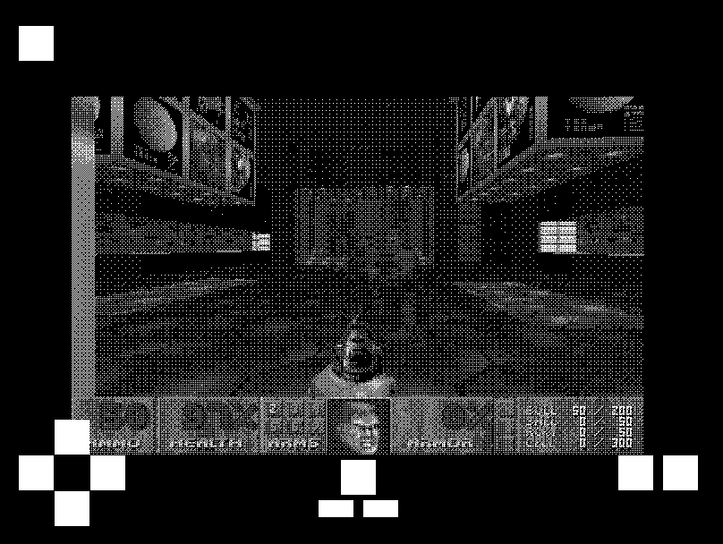
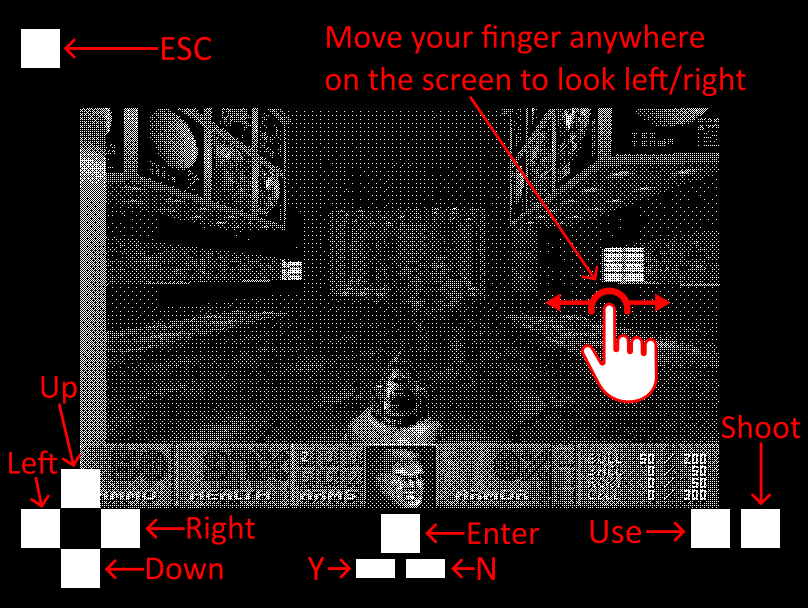

# Kindle Touch Doom

Doom port for touchscreen Kindles, based on [doomgeneric](https://github.com/ozkl/doomgeneric).

For discussions, see [this thread on the MobileRead forums](https://www.mobileread.com/forums/showthread.php?p=4313126), or join my Discord:

## Compatibility

- Only tested on [KT3](https://wiki.mobileread.com/wiki/Kindle_Serial_Numbers)
- Should work on other [KT](https://wiki.mobileread.com/wiki/Kindle_Serial_Numbers) models [with the same 600 × 800 screen](https://en.wikipedia.org/wiki/Amazon_Kindle#Specifications)
- Will currently not work on the higher-res Paperwhite models

## Installation Instructions

1. [Jailbreak](https://www.mobileread.com/forums/showthread.php?t=320564) your Kindle
2. Install the [KUAL](https://www.mobileread.com/forums/showthread.php?t=203326) extension by unzipping the GitHub release into the `extensions` folder on your Kindle.
3. Put your `doom.wad` into the folder of this extension.
4. Launch using KUAL
5. To exit, press the `ESC` on-screen button, select "Quit Game", then `Enter`, then `Y` (see below for the button locations)

### Controls

## Compilation Instructions

### Compile for Kindle

In the `toolchain` directory is a Dockerfile that can be used to build a toolchain based on the [KMC Kindle SDK](https://github.com/KindleModding/kindle-sdk) and the [KOReader cross-compile toolchains](https://github.com/koreader/koxtoolchain), inspired by the [Kindle Modding Wiki tutorial](https://kindlemodding.org/kindle-dev/gtk-tutorial/prerequisites.html).

It can be used like this:

1. Build the Docker image:
    - For Kindle firmware versions below 5.16.3:
        - `docker build ./toolchain -t "himbeer/kindle-touch-doom" --build-arg "SDK_TARGET=kindlepw2"`
    - or for Kindle firmware versions 5.16.3 and above:
        - `docker build ./toolchain -t "himbeer/kindle-touch-doom" --build-arg "SDK_TARGET=kindlehf"`
    - (you only need to do this once, it will take over 10 minutes)
2. Use the Docker image to build the source code of this project:
    - `docker run --rm -v ./doomgeneric:/source "himbeer/kindle-touch-doom" -c "cd /source && make clean && make"`

Or alternatively, run `./toolchain/docker-build.sh`. The SDK target can be defined using the first parameter. `kindlepw2` is the default. If you are using firmware 5.16.3 or above, then run `./toolchain/docker-build.sh kindlehf`.

The output binary will now be at the path `./doomgeneric/doomgeneric_kindle` and can be copied to your Kindle.

To use it in the KUAL extension, rename it to `doom` and copy it into the directory `./kual_extension` like so: `mv doomgeneric/doomgeneric_kindle kual_extension/doom`. Then copy the entire `kual_extension` directory into the `extensions` directory of your jailbroken Kindle and name it `Doom`.

### Compile for PC

In order to make debugging easier, there is a PC version that opens two windows to simulate the Kindle screen.

It can be built using the Makefile.pc like this: `make -f Makefile.pc clean && make -f Makefile.pc`

Then it can be launched like this: `./doomgeneric -iwad your_wad_file.wad -scaling 2`

You should now see two windows like this:

## Credits

- Doomgeneric: [ozkl on GitHub](https://github.com/ozkl/doomgeneric)
- Framebuffer Display & Dithering Code: [geekmaster on the MobileRead Forums](https://www.mobileread.com/forums/showthread.php?t=177455)
- C Compiler Toolchain: [KMC Kindle SDK](https://github.com/KindleModding/kindle-sdk) & [KOReader cross-compile toolchains](https://github.com/koreader/koxtoolchain)
- Finger Icon: [inspire-studio on Pixabay](https://pixabay.com/vectors/touch-digital-icon-finger-press-6602643/)
